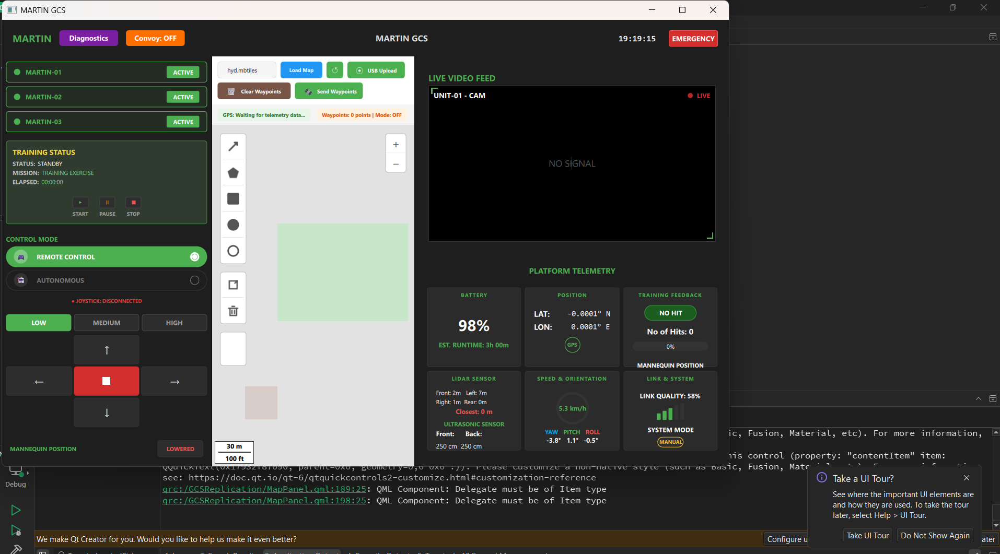

# MARTIN GCS – QML UI Dashboard

A component-based Ground Control Station (GCS) dashboard built with Qt Quick/QML.

## Screenshots

### Full Dashboard View


### Responsive View


## Features
- **Responsive Design**: UI scales proportionally using `window.uiScale` and adapts to window resizing.
- **Left Panel**: Martin vehicle list, training status controls, control mode toggle, large joystick buttons, and mannequin status.
- **Map Panel**: Interactive toolbar for map management and waypoints with a grid-based placeholder view.
- **Right Panel**: Live video feed monitor (expanded) and detailed telemetry grid (battery, GPS, sensors, system status).

## How to Run

### Option 1: Using CMake (Recommended)
1. Open the project folder in **Qt Creator**.
2. Select a **Qt 6 (MSVC/MinGW)** kit.
3. Build and Run (**Ctrl+R**).

### Option 2: Command Line (MSVC)
```powershell
mkdir build
cd build
cmake ..
cmake --build .
.\appMartinGCS.exe
```

## Design Decisions & Assumptions
- **Scaling**: All dimensions are linked to a global `uiScale` factor in `Main.qml`, ensuring the UI remains usable on different resolutions.
- **Joystick Priority**: The joystick section in the Left Panel is designed to occupy maximum available space for better touch/mouse interaction.
- **Mock Data**: Telemetry values and video feed are simulated using QML Timers and Animations.
- **Separation of Concerns**: Each major UI area (TopBar, LeftPanel, Map, RightPanel) is isolated in its own file for easier maintenance.
- **Cleanup**: Comments have been removed from the source code as requested to provide a clean delivery version.
